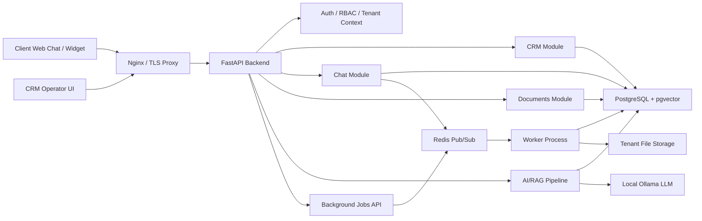
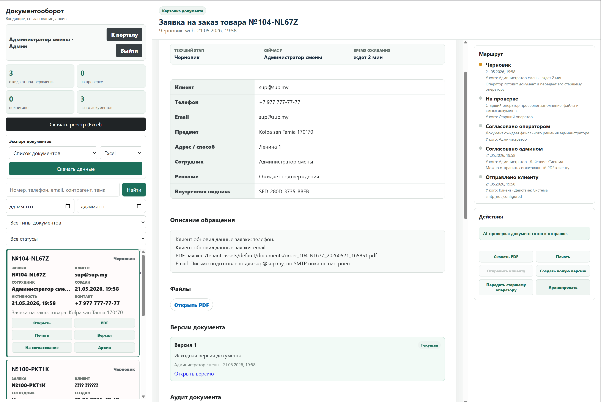
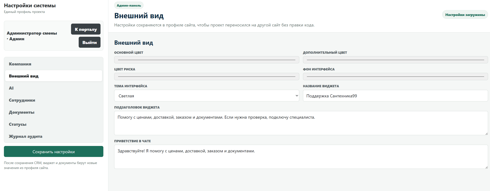
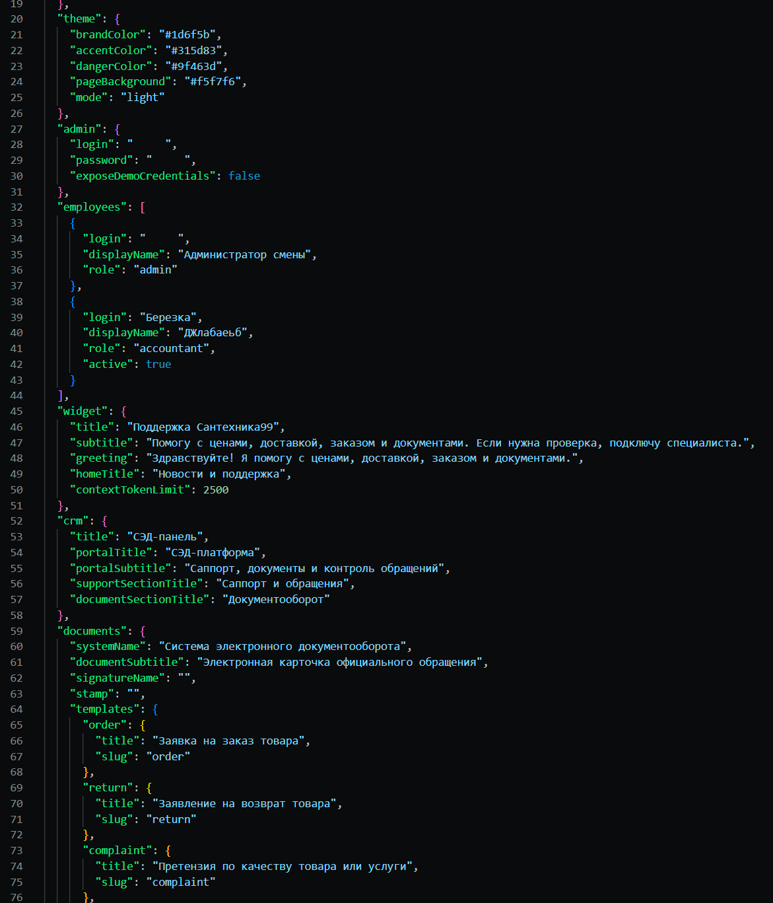
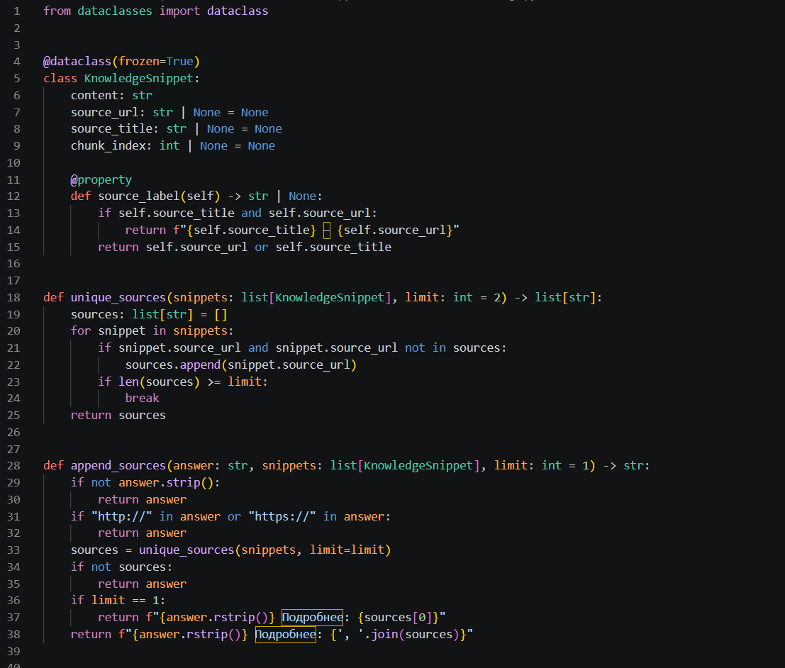
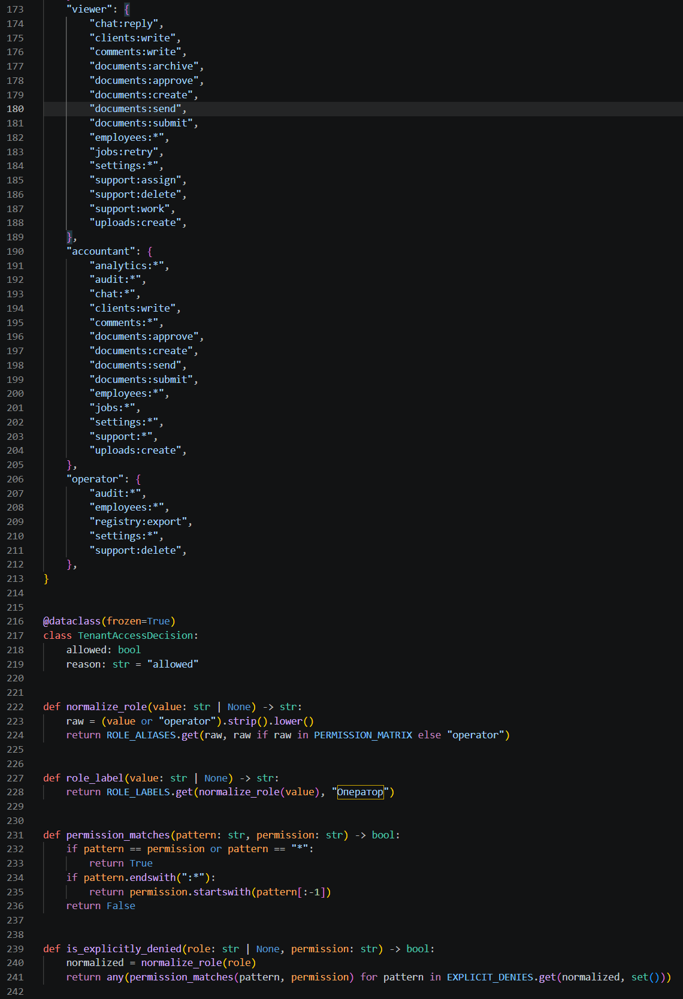
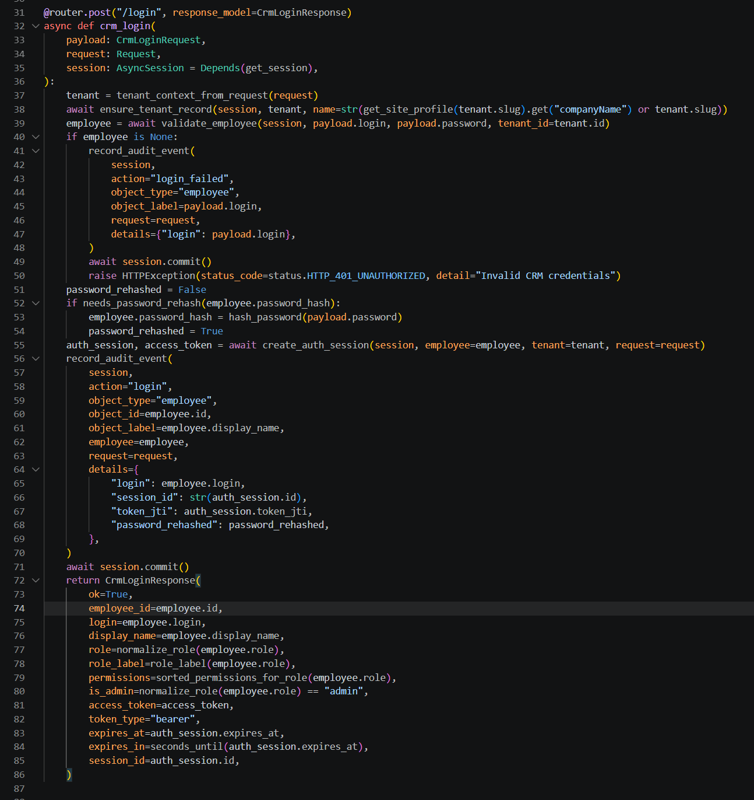

# AI CRM + SED Platform

B2B SaaS platform for AI-powered customer support, CRM workflows and electronic document management.

This repository is a public showcase version. The original project contains commercial/private code and configuration, so sensitive implementation details, secrets, client data and production credentials are not published here.

## What The Product Does

The platform connects customer communication, operator CRM, AI assistance and document workflow into one controlled process.

- Customer sends a message through a web chat/widget.
- AI classifies the request and answers using a tenant-specific knowledge base.
- If needed, the system creates a CRM ticket and routes it to an operator.
- Operator works with the client context, ticket status, comments and documents.
- The system generates PDF documents and stores document versions.
- Management gets audit logs, statuses, exports and operational visibility.

## Key Features

- CRM: clients, tickets, statuses, priorities, comments, employee workflow.
- AI/RAG: local LLM pipeline, intent classification, action extraction, contextual answers.
- SED / Document workflow: PDF generation, document versions, approvals, archive.
- Multi-tenant / white-label: tenant-aware API, site profiles, isolated storage paths.
- Realtime: WebSocket events with Redis Pub/Sub backend.
- Security: JWT/session auth, RBAC, signed downloads, protected uploads, audit logs.
- DevOps: Docker Compose, app/worker separation, health/readiness endpoints, metrics.
- Reliability: background jobs, retries, DLQ, backup/restore workflow.
- Testing: 135+ automated tests passed in local launch verification.
- Public evaluation: reusable intent and RAG fixtures, Recall@K, MRR, nDCG, macro-F1 and latency reports.

## Tech Stack

- Backend: Python, FastAPI, SQLAlchemy, Pydantic
- Database: PostgreSQL, Alembic, pgvector
- Realtime / Jobs: Redis, WebSocket, background worker
- AI: Ollama, RAG, embeddings, intent/action pipeline
- Documents: PDF generation, signed/protected downloads
- Infrastructure: Docker, Docker Compose, Nginx/TLS proxy
- Security: JWT, RBAC, CORS hardening, upload validation, audit logs
- Frontend: HTML, CSS, JavaScript CRM UI and chat widget

## Architecture



More details: [docs/architecture.md](docs/architecture.md)

## RAG Quality Lab

The repository includes a runnable, dependency-free evaluation toolkit. It is
separate from the private commercial backend and can be used with any retriever
or intent classifier.

```bash
git clone https://github.com/DenisGeide/ai-crm-sed-platform.git
cd ai-crm-sed-platform
python -m pip install -e .
rag-quality-lab demo
```

Included public fixtures:

- **118** sanitized intent/action regression cases;
- **30** bilingual retrieval questions with gold document identifiers;
- **12** citation and required-fact answer contracts;
- **12** fictional RU/EN support documents;
- machine-readable JSON and human-readable Markdown reports;
- classification accuracy, macro-F1 and full decision-contract checks;
- Recall@1/3/5, MRR, nDCG@1/3/5, citation checks and p50/p95 latency.

Start with the [RAG Quality Lab guide](evaluation/README.md) or inspect the
[committed reports](reports/). The bundled token-overlap retriever is only a
format and integration baseline; it is not presented as the production RAG
implementation.

## Screenshots

Public demo screenshots are available in the [`screenshots/`](screenshots/) folder.  
All retained screenshots use demo data or sanitized production-like views.
Signed URLs, access tokens and customer records are not shown.

### Product Preview

| Document Workflow | System Settings |
|---|---|
|  |  |

<details>
<summary>View sanitized JSON configuration</summary>



</details>

### Technical Snippets

<details>
<summary>View code snippets</summary>

#### FastAPI / RAG


#### RBAC / Permissions


#### Auth / CRM Login


</details>


## Demo Flow

A short demo scenario is described in [docs/demo-flow.md](docs/demo-flow.md):

1. Customer asks a question in chat.
2. AI answers using RAG and classifies the request.
3. Ticket appears in CRM.
4. Operator takes the ticket into work.
5. PDF document is generated and linked to the ticket.
6. Audit, realtime updates and metrics are shown.

## Public GitHub Note

Most of this project was developed as a local/commercial R&D product. This public
repository contains the architecture, product description, screenshots, sanitized
technical examples and a fully reusable evaluation toolkit. It does not contain
client data, production credentials or private business-specific implementation.

**RU:** Это публичная showcase-версия проекта. Приватные данные, секреты,
production-конфигурации, документы клиентов и чувствительная бизнес-логика здесь
не публикуются. Наборы из `evaluation/` синтетические или обезличенные и могут
использоваться отдельно от коммерческого приложения.

## License

Source code and documentation are available under the
[Apache License 2.0](LICENSE). Public evaluation fixtures are released under
[CC0 1.0](evaluation/DATA_LICENSE.md).

