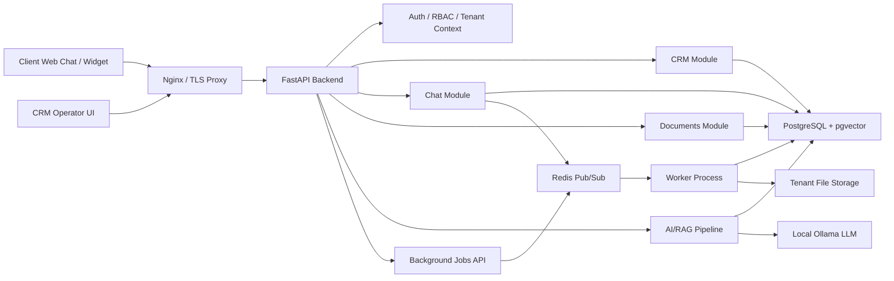

# AI CRM + SED Platform

B2B SaaS platform for AI-powered customer support, CRM workflows and electronic document management.

This repository is a public showcase version. The original project contains commercial/private code and configuration, so sensitive implementation details, secrets, client data and production credentials are not published here.

## What The Product Does

The platform connects customer communication, operator CRM, AI assistance and document workflow into one controlled process.

- Customer sends a message through a web chat/widget.
- AI classifies the request and answers using a tenant-specific knowledge base.
- If needed, the system creates a CRM ticket and routes it to an operator.
- Operator works with the client context, ticket status, comments and documents.
- The system generates PDF documents and stores document versions.
- Management gets audit logs, statuses, exports and operational visibility.

## Key Features

- CRM: clients, tickets, statuses, priorities, comments, employee workflow.
- AI/RAG: local LLM pipeline, intent classification, action extraction, contextual answers.
- SED / Document workflow: PDF generation, document versions, approvals, archive.
- Multi-tenant / white-label: tenant-aware API, site profiles, isolated storage paths.
- Realtime: WebSocket events with Redis Pub/Sub backend.
- Security: JWT/session auth, RBAC, signed downloads, protected uploads, audit logs.
- DevOps: Docker Compose, app/worker separation, health/readiness endpoints, metrics.
- Reliability: background jobs, retries, DLQ, backup/restore workflow.
- Testing: 135+ automated tests passed in local launch verification.

## Tech Stack

- Backend: Python, FastAPI, SQLAlchemy, Pydantic
- Database: PostgreSQL, Alembic, pgvector
- Realtime / Jobs: Redis, WebSocket, background worker
- AI: Ollama, RAG, embeddings, intent/action pipeline
- Documents: PDF generation, signed/protected downloads
- Infrastructure: Docker, Docker Compose, Nginx/TLS proxy
- Security: JWT, RBAC, CORS hardening, upload validation, audit logs
- Frontend: HTML, CSS, JavaScript CRM UI and chat widget

## Architecture

More details: [docs/architecture.md](docs/architecture.md)

## Screenshots To Add

Planned public screenshots are listed in [docs/screenshot-plan.md](docs/screenshot-plan.md).

Recommended preview set:

- `screenshots/architecture-overview.png`
- `screenshots/crm-dashboard.png`
- `screenshots/client-chat.png`
- `screenshots/document-center.png`
- `screenshots/status-json-config.png`
- `screenshots/tests-135-passed.png`

## Demo Flow

A short demo scenario is described in [docs/demo-flow.md](docs/demo-flow.md):

1. Customer asks a question in chat.
2. AI answers using RAG and classifies the request.
3. Ticket appears in CRM.
4. Operator takes the ticket into work.
5. PDF document is generated and linked to the ticket.
6. Audit, realtime updates and metrics are shown.

## Code Snippets

Safe public snippets should be placed in [snippets/](snippets/).

Recommended snippets:

- FastAPI route with tenant-aware dependency.
- RBAC/JWT access check.
- RAG search/query flow with pgvector.
- Document status JSON configuration.
- Background job lifecycle example.

See [snippets/README.md](snippets/README.md) before publishing code.

## Public GitHub Note

Most of this project was developed as a local/commercial R&D product. This public repository is intended as a clean showcase: architecture, product description, screenshots, sanitized code snippets and demo materials.

RU: Это публичная showcase-версия проекта. Приватные данные, секреты, production-конфигурации и чувствительная бизнес-логика не публикуются.

